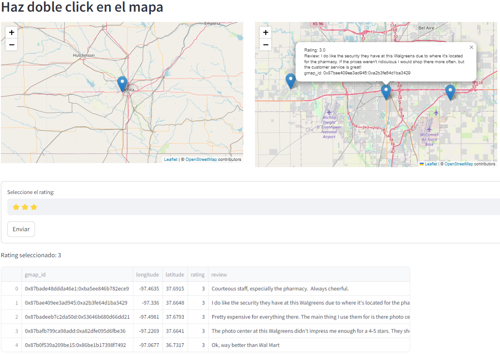
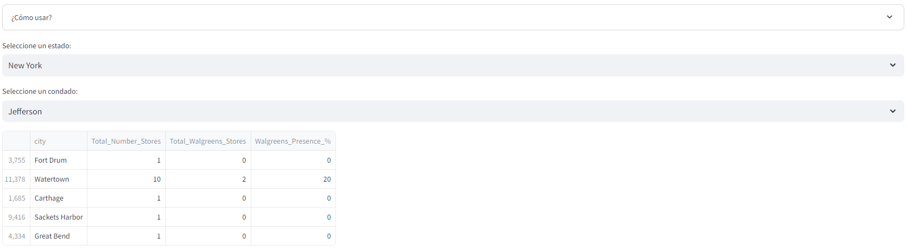
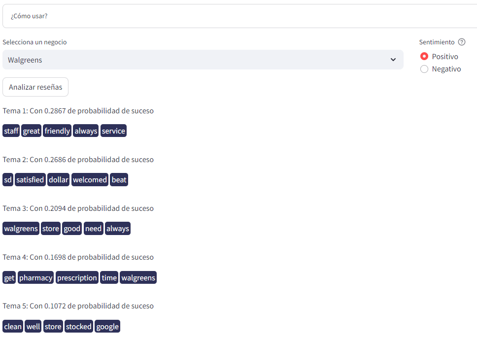
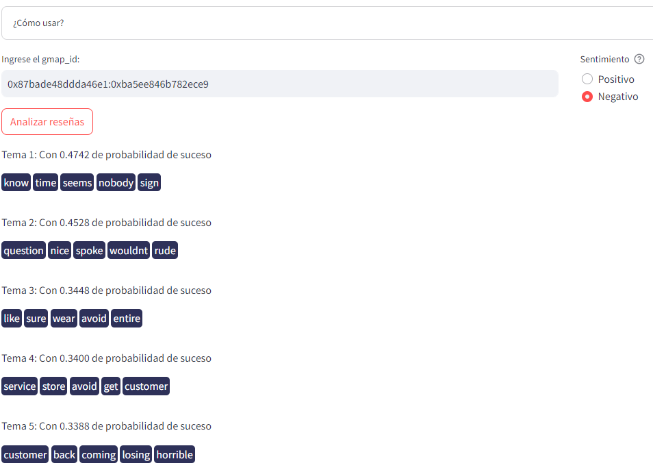

# ```Modelos de Recomendación - ML```

## Recomendación de tiendas 🏪

Enfocamos en recomendar tiendas de Walgreens cercanas a la **ubicación** escogida en el mapa. En este modelo de recomendación el *input* y el *output* consiste en lo siguiente:

- **Inputs**
  - Ubicación seleccionada en el mapa de entrada, donde se quiera encontrar las tiendas más cercanas.
  - Número de estrellas o la calificación de las tiendas que desea visualizar.
- **Outputs**
  - Ubicaciones de las tiendas más cercanas a la ubicación seleccionada, presentando en cada pin del mapa el comentario más relevante y su respectiva calificación (rating) para cada tienda.
  - Una tabla donde se proporciona información sobre cada tienda, incluyendo su geolocalización, calificación (rating), reseñas y el ID único de cada una.

El Notebook usado para el desarrollo de este modelo de recomendación es el siguiente: [Modelo de recomendación N°01](/01.ML_Ubicación%20de%20Tiendas.ipynb)



## Recomendación de ubicación de nuevas tiendas 📌

El modelo se fundamenta en datos sólidos y análisis profundos, lo que lo convierte en una hoja de ruta clara y confiable para identificar las ubicaciones óptimas de nuevas tiendas Walgreens. En este modelo de recomendación el *input* y el *output* consiste en lo siguiente:

- **Inputs**
  - Elegir un estado y los condados disponibles que se muestran automáticamente.

- **Outputs**
  - Con cada selección, nuestro modelo se activa, teniendo en cuenta factores cruciales como la población, el PIB y la competencia local.
  - Cinco principales ciudades del condado.
  - Evaluación de la presencia de la competencia mediante la cantidad de tiendas por ciudad.
  - Medimos la presencia de Walgreens en ese mercado mediante la cantidad de tiendas Walgreens existentes.

El Notebook usado para el desarrollo de este modelo de recomendación es el siguiente: [Modelo de recomendación N°02](/02.%20ML2_Reubicación_Tiendas.ipynb).



## Modelo de análisis de reseñas de competidores 📉

El modelo se fundamenta en el análisis de reseñas, creando una columna temporal de análisis de sentimientos y clasificando en temas o tópicos las reseñas según su positividad o negatividad. En este modelo de recomendación el *input* y el *output* consiste en lo siguiente:

- **Inputs**
  - Selecciona la marca (cliente o competencia) y la polaridad de las reseñas (positivas o negativas).

- **Outputs**
  - Devuelve los 5 temas principales junto con las 5 palabras más probables de aparecer juntas en una reseña para la marca seleccionada.

El Notebook usado para el desarrollo de este modelo de recomendación es el siguiente: [Modelo de recomendación N°03](/03.%20ML3_Analisis_Reseñas.ipynb).



## Modelo de análisis de reseñas por tienda 📊

El modelo se fundamenta en el análisis de reseñas, creando una columna temporal de análisis de sentimientos y clasificando en temas o tópicos las reseñas según su positividad o negatividad. En este modelo de recomendación el *input* y el *output* consiste en lo siguiente:

- **Inputs**
  - Selecciona el establecimiento (Walgreens) y la polaridad de las reseñas (positivas o negativas).

- **Outputs**
- Devuelve los 5 temas principales junto con las 5 palabras más probables de aparecer juntas en una misma reseña para el establecimiento seleccionado.

El Notebook usado para el desarrollo de este modelo de recomendación es el siguiente: [Modelo de recomendación N°04](/03.%20ML3_Analisis_Reseñas.ipynb).


