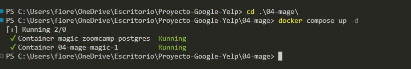
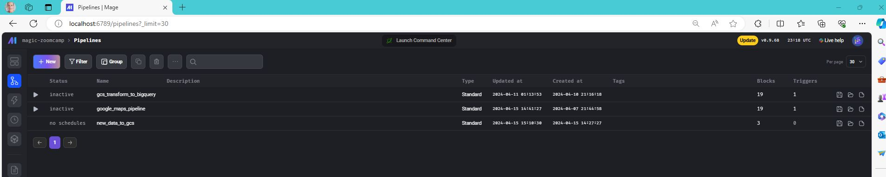
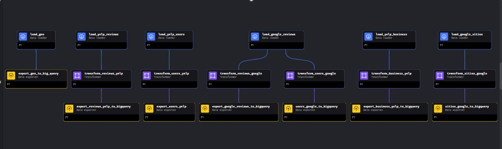

# Mage

Mage es una herramienta de orquestación de datos de código abierto para transformar e integrar datos.
🧙 Un mago es alguien que usa magia. La tecnología avanzada de mage.ai es indistinguible de la magia.
La misión de mage.ai es hacer que la tecnología de IA sea más accesible mediante la construcción de herramientas de datos para ingenieros y científicos.

# Pipelines y Orquestación de Carga Inicial

Para la orquestación y desarrollo del pipeline del ETL elegimos trabajar con Mage, creamos una imagen de Mage con Docker y desde ahí nos conectamos a Mage para crear el pipeline de nuestro proyecto.
Mage permite crear pipelines de manera rápida, sencilla y accesible, tanto que parece magia.
Los pipelines se van creando y construyendo con bloques de código que se van orquestando, linkenadolos através de la interfaz gráfica del usuario, lo cual es muy intuitivo y simplifica la orquestación sin dificultades adicionales.

De esta forma, creamos los pipelines para la transformación de la carga inicial de datos desde Google Cloud Storage.
Se crean cargando la data a un endpoint the mage.ai que se levanta con una imagen de mage en docker, utilizando docker desktop en local.

Con esto habilitamos el puerto para conectarnos a mage.ai: localhost:6789

Desde aqui es donde se produce la magia, y se crean los pipelines con los beneficios de:

- Para crear los pipelines, se usan bloques y vinculando los bloques se crea el flujo, y luego se puede orquestar con gatillos, sensores, variables, acciones o condicionales. Y el mismo se puede ejecutar configurándolo o simplemente corriendo con hacer click en run@once, y corre todo en cascada.
- Para transformar la data primero definimos el modelado, creando nuestro DER, que es nuestro propósito/objetivo, y se fueron transformando las tablas desde el DataLake de GCS para terminar en BigQuery.
- Para ello realizamos Normalizaciones de los data typer, estandarizando los nombres de las columnas, eliminando columnas innecesarias, creando nuevas tablas, y ajustando datos como el time de las resenas de ambas plataformas, para unificar todas en una misma.

Así es como se ve el tree de nuestro pipeline que toma la data de nuestro DataLake en GCS y luego de transformarla, la almacena en tablas en nuestro DataWarehouse.
Lo mejor de Mage es que es Open Source, que permite hacer la orquestación de manera fácil y ágil.

La interfaz del Usuario es muy intuitivo, permite reciclar código, visualizar el proceso y los progresos sin dificultades. A medida que se va creando se puede testear el progreso para ir corrigiendo al momento en vez de al final como otras herramientas de orquestación.

**Con esto queda creado nuestro modelo y tablas en BigQuery.**
