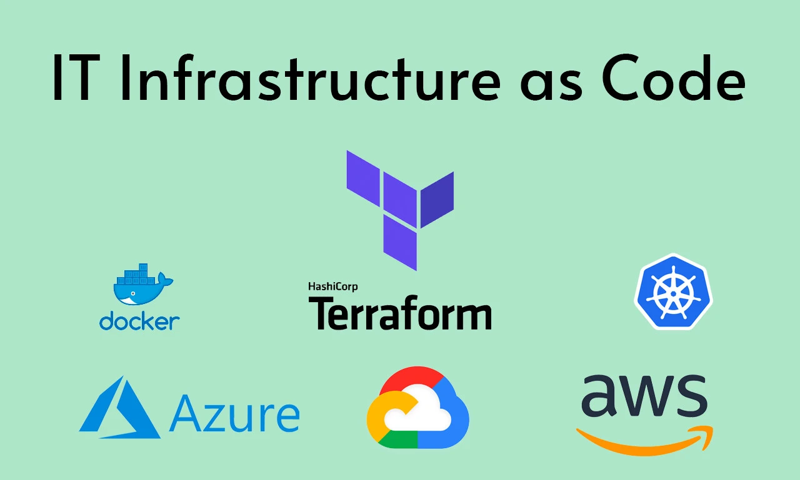
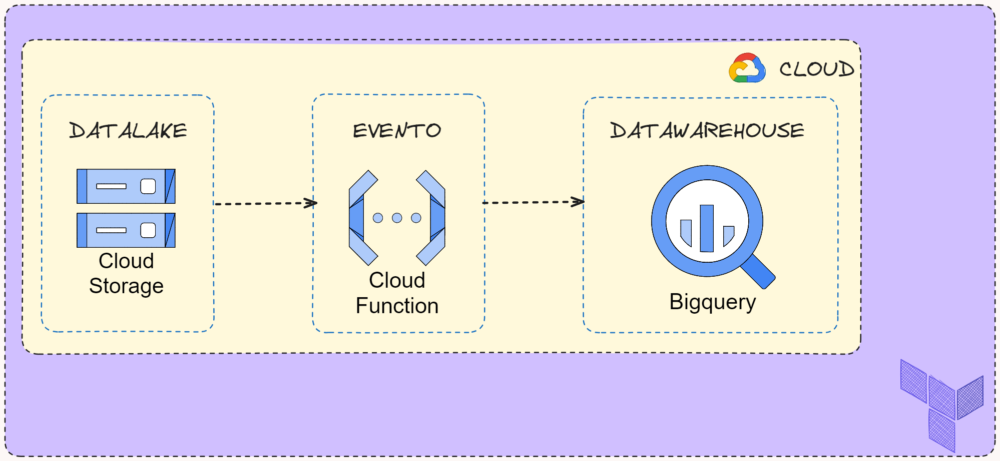

# Terraform y Google Cloud Platform

Terraform es una herramienta de infraestructura como código (IaC) de código abierto que permite a los desarrolladores y operadores proporcionar, cambiar y gestionar la infraestructura de TI de manera segura y eficiente. Terraform puede manejar servicios en la nube, así como servicios locales.

## Configuración Terraform

* Configura el proveedor de Google Cloud: Establece la versión del proveedor de Google Cloud y proporciona las credenciales necesarias para autenticarse con Google Cloud. También establece el proyecto y la región predeterminados para los recursos que se crearán.

* Crea un nuevo bucket de Google Cloud Storage: Este bucket se utilizará para almacenar los datos y el código de la función de Cloud Functions. El bucket tiene una regla de ciclo de vida que aborta las cargas incompletas después de 1 día.

* Carga archivos en el bucket de Google Cloud Storage: Carga todos los archivos del directorio 01-data-cleaned en el bucket de Google Cloud Storage.

* Crea un nuevo conjunto de datos de BigQuery: Este conjunto de datos se utilizará para almacenar los datos procesados por la función de Cloud Functions.

* Crea un archivo ZIP con el código de la función de Cloud Functions: Este archivo ZIP se cargará en el bucket de Google Cloud Storage y se utilizará para desplegar la función de Cloud Functions.

* Carga el archivo ZIP en el bucket de Google Cloud Storage: Carga el archivo ZIP que contiene el código de la función de Cloud Functions en el bucket de Google Cloud Storage.

* Despliega una función de Cloud Functions: Esta función se activará cuando se cargue un nuevo archivo en el bucket de Google Cloud Storage. La función carga los datos del archivo en BigQuery.

