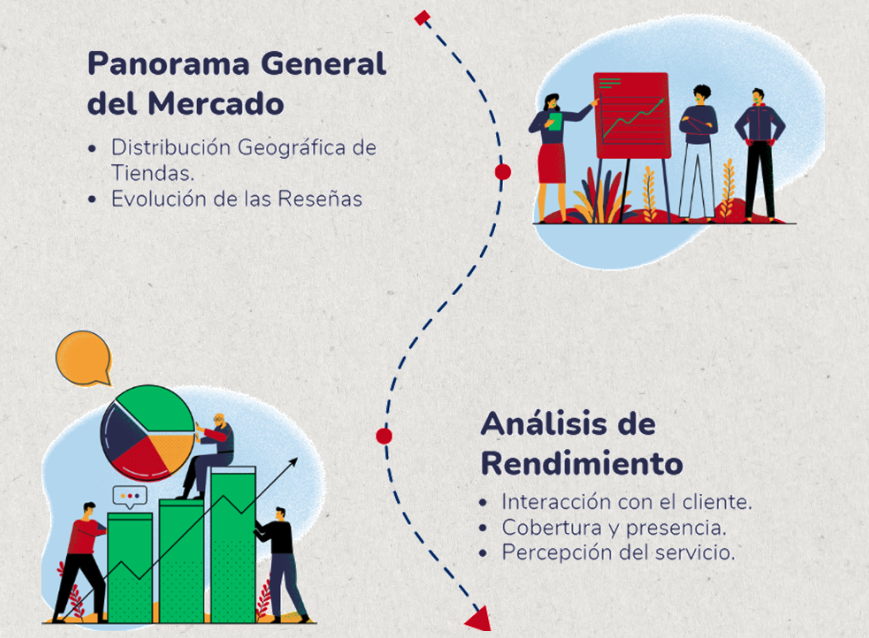

# Visualización de datos en Tableau

Para visualizar la posición de walgreens en el mercado, hemos creado 2 tableros, que comparan al cliente con su competencia directa.

- el primero ofrece una vista general del panorama del mercado de tiendas de conveniencia,
- el segundo presenta los indicadores clave de rendimiento (KPIs) de Walgreens en el mercado de tiendas de conveniencia,
- ambos tableros cuentan con filtros interactivos por localizacion, por competidor y por fecha

Puedes acceder al libro de trabajo [aquí](/Tablero_siniestros_viales_CABA.twb)
